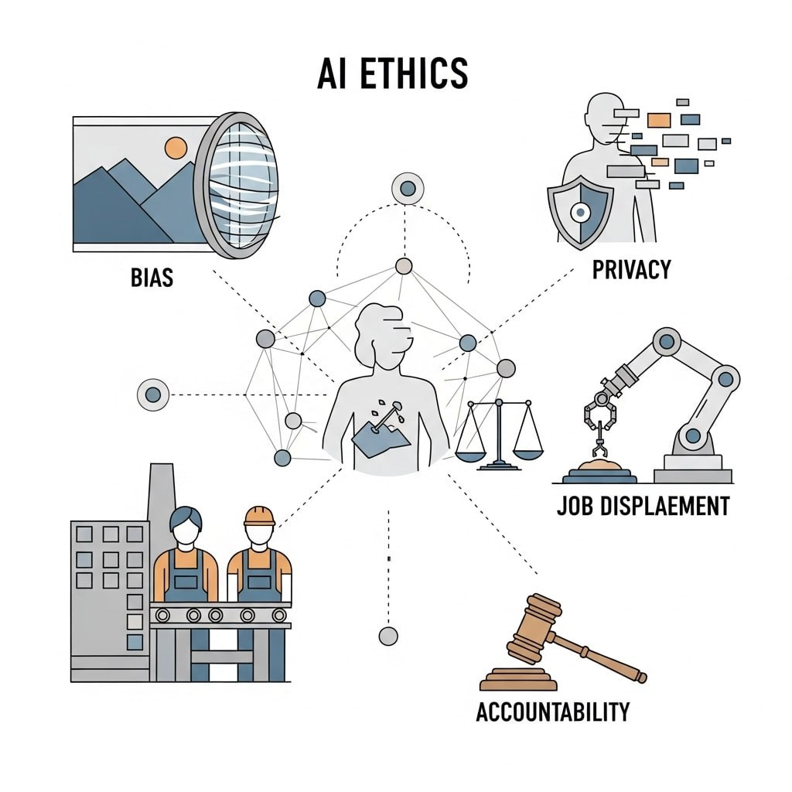

# Курс «Етика ШІ та соціальні наслідки»

Цей курс допоможе зрозуміти, як сучасні технології штучного інтелекту впливають на суспільство, право і моральні норми.

## Що ви дізнаєтесь:

- Основні поняття та терміни, пов’язані зі штучним інтелектом;
- Етичні проблеми, пов’язані з автоматизацією та прийняттям рішень ШІ;
- Соціальні виклики: упередження алгоритмів, конфіденційність, безпека і відповідальність;
- Приклади позитивного і негативного впливу ШІ на різні сфери життя;
- Методи мінімізації ризиків і шляхи розвитку етичного ШІ.

---

Цей тест допоможе вам перевірити, наскільки добре ви засвоїли основні поняття та проблематику етики штучного інтелекту.

Успіхів!

